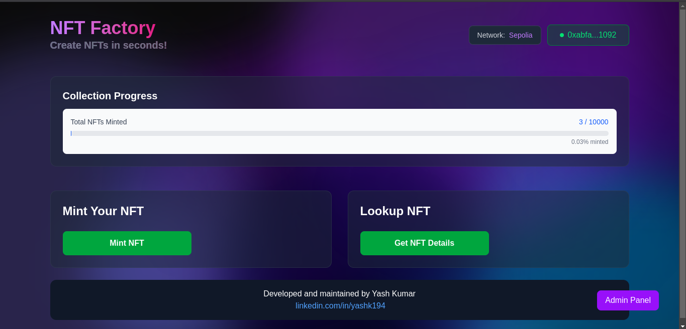
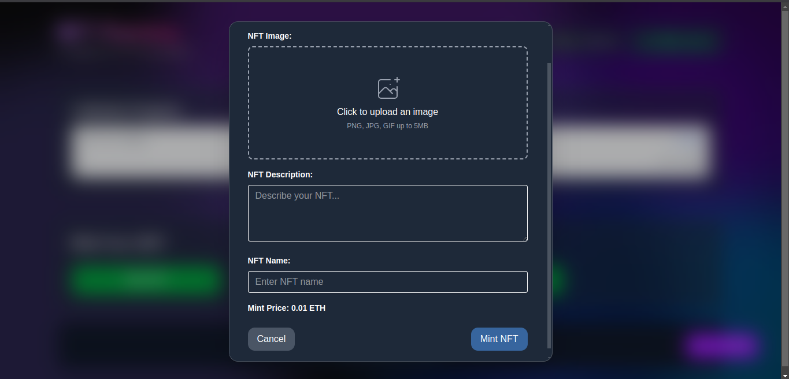
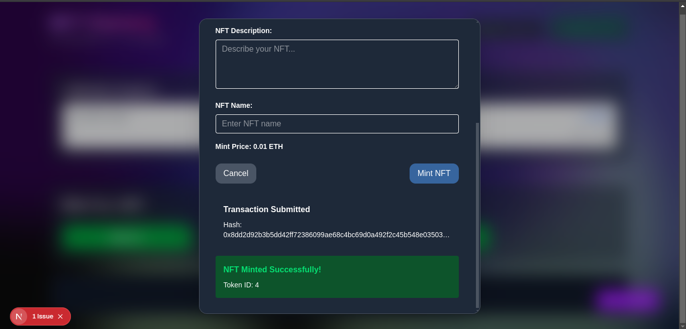
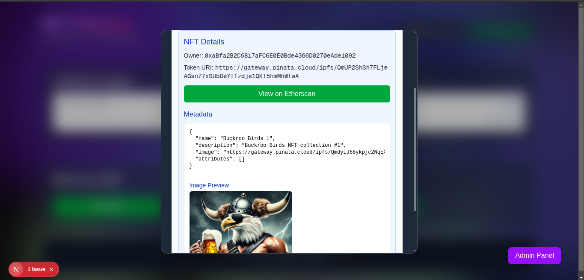
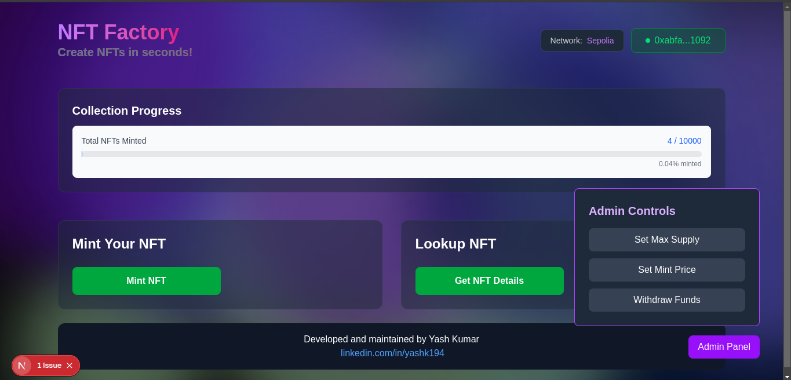
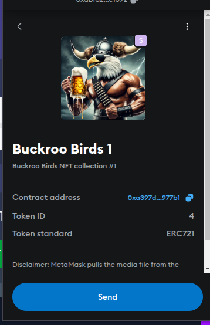

# NFT Factory

## Overview

NFT Factory is a platform that allows users to create and manage NFTs seamlessly in seconds. The project is developed using Solidity for smart contracts and features a Next.js frontend for user interaction.

## Features

- **Smart Contracts:** Written in Solidity to handle NFT creation and management.
- **Unit Testing:** Comprehensive testing using Chai.
- **Development Environment:** Built with Hardhat for efficient contract development and testing.
- **Deployment:** Uses Hardhat Ignition for automated smart contract deployment.
- **Etherscan Verification:** The smart contracts are verified on Etherscan for transparency.
- **Frontend:** Developed using Next.js, a React-based framework.
- **Hosting:** The frontend is deployed on Vercel for fast and reliable hosting.

## Functionalities

### Admin Functionalities

- The wallet that deploys the contract is set as admin.

- The admin can set the total NFT supply, set the minting price, and withdraw funds from the contract.

- Admin controls are only visible to the admin.

### Other Functionalities

- The platform automatically detects changes in the wallet and network chain.

- NFTs are given token IDs starting from 1.

- NFT metadata (Image, Name, Description) are stored on IPFS.

- Pinata along with axios are used for storing data on IPFS.

## Technologies Used

- **Solidity:** For smart contract development.
- **Hardhat:** Development and testing framework.
- **Chai:** For unit testing.
- **Hardhat Ignition:** For deployment automation.
- **Next.js:** As the frontend framework.
- **Vercel:** For hosting the frontend application.

## Smart Contract

- **Contract Address (Sepolia):** `0xa397d7e7C68C9b6aAC9A09F38F1F66c7CcE977b1`
- **Etherscan Link:** [https://sepolia.etherscan.io/address/0xa397d7e7C68C9b6aAC9A09F38F1F66c7CcE977b1](https://sepolia.etherscan.io/address/0xa397d7e7C68C9b6aAC9A09F38F1F66c7CcE977b1)

## Project Domain

- **Live Application:** [nft-factory-yashk.vercel.app](https://nft-factory-yashk.vercel.app/)

## Installation and Setup

### Prerequisites

Ensure you have the following installed:

- Node.js (latest LTS version)
- MetaMask (for interacting with deployed contracts)

### Steps to Run Locally

1. Clone the repository:
   ```sh
   git clone https://github.com/YashK-194/nft-factory.git
   cd nft-factory
   ```
2. Check out the respective README files for backend and frontend setup:
   - **Backend README**(backend/README.md)
   - **Frontend README**(frontend/README.md)

## Screenshots

**Homepage**

**Minting NFT**

**After Minting NFT**

**NFT Details**

**Admin Controls**

**NFT in wallet**


## License

This project is licensed under the MIT License.

## Contact

For any inquiries, reach out via GitHub, LinkedIn: [linkedin.com/in/yashk194](https://www.linkedin.com/in/yashk194/) or email at `yashkm194@gmail.com`.
